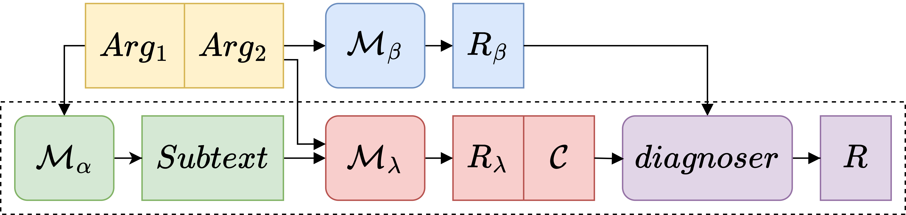

# IDRR_Subtext

<!-- Using subtexts on IDRR. -->

[Using Subtext to Enhance Generative IDRR](https://aclanthology.org/2025.acl-short.35/)

## Abstract

Implicit Discourse Relation Recognition (abbr., IDRR) is a NLP task of classifying argument pairs into different types of semantic relations. Arguments contain subtexts, some of which are beneficial to the perception of semantic relations. However, subtexts are connotative. The neural IDRR model fails to be aware of them without being given pertinent prompts. In this paper, we leverage LLaMA to generate subtexts for argument pairs, and verify the effectiveness of subtext-based IDRR. We construct an IDRR baseline using the decoder-only backbone LLaMA, and enhance it with subtext-aware relation reasoning. A confidence-diagnosed dual-channel network is used for collaboration between in-subtext and out-of-subtext IDRR. We experiment on PDTB-2.0 and PDTB-3.0 for both the main-level and secondary-level relation taxonomies. The test results show that our approach yields substantial improvements compared to the baseline, and achieves higher F1-scores on both benchmarks than the previous decoder-only IDRR models. We make the source codes and data publicly available.

<!-- `The repo is currently under construction and improvement.` -->

# Requirements

- [utils_zp](https://github.com/ZpWang-AI/utils_zp)
- [IDRR_data](https://github.com/IDRR-Research-Group-Soochow-University/IDRR_data)
- [llm_zp](https://github.com/ZpWang-AI/llm_zp)
- [LLaMA-Factory_zp_subtext](https://github.com/ZpWang-AI/LLaMA-Factory_zp_subtext)
<!-- - [llama_zp](https://github.com:ZpWang-AI/LLaMA-Factory_zp) -->

# Citation

~~~text
@inproceedings{wang-etal-2025-using,
    title = "Using Subtext to Enhance Generative {IDRR}",
    author = "Wang, Zhipang  and
      Hong, Yu  and
      Sun, Weihao  and
      Zhou, Guodong",
    booktitle = "Proceedings of the 63rd Annual Meeting of the Association for Computational Linguistics (Volume 2: Short Papers)",
    month = jul,
    year = "2025",
    address = "Vienna, Austria",
    publisher = "Association for Computational Linguistics",
    url = "https://aclanthology.org/2025.acl-short.35/",
    doi = "10.18653/v1/2025.acl-short.35",
    pages = "464--473",
    ISBN = "979-8-89176-252-7"
}
~~~

# Acknowledgement

This repo benefits from [LLaMA-Factory](). Thanks for their wonderful works.